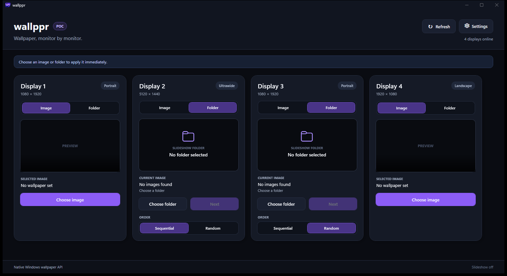

<p align="center">
  
</p>

# wallppr

Different wallpaper for each monitor on Windows 11.

Wallppr lets every display use its own image or wallpaper folder. Changes happen immediately, and folder wallpapers can rotate automatically without disabling Windows virtual desktops.



*Screenshot uses empty demo selections. No third-party wallpaper artwork is included.*

## Features

- Choose a separate image or folder for each monitor.
- Apply a selected image or folder wallpaper immediately.
- Move to the next folder image whenever you want.
- Show folder images in sequential or random order.
- Change all folder wallpapers on one global timer.
- See the time remaining before the next automatic change.
- Remember display choices and app settings between launches.
- Start with Windows and keep running in the notification area.
- Detect monitor resolution and orientation.
- Refresh the display list manually after hardware changes.
- Prevent multiple copies of Wallppr from running at once.

## Getting started

Wallppr is currently an early Windows build and does not have an installer yet.

### Requirements

- Windows 11
- [.NET 10 SDK](https://dotnet.microsoft.com/download/dotnet/10.0)

### Run from source

```powershell
git clone https://github.com/fjdiazt/wallppr.git
cd wallppr
dotnet run --project Wallppr.csproj
```

## Using Wallppr

### Use one image

1. Find the display you want to change.
2. Select **Image**.
3. Choose the preview or **Choose image**.
4. Pick an image. Wallppr applies it immediately.

### Use a wallpaper folder

1. Select **Folder** for a display.
2. Choose **Sequential** or **Random**.
3. Select **Choose folder** and pick a folder containing images.
4. Use **Next** whenever you want another image.

### Change folder wallpapers automatically

1. Open **Settings**.
2. Enter the number of seconds between changes.
3. Use `0` to turn automatic changes off.

The timer is global: when it expires, every display using a folder moves to its next image. Choosing a folder or pressing **Next** restarts the countdown.

## Background behavior

Settings can make Wallppr:

- Start when you sign in to Windows.
- Hide in the notification area when minimized.
- Keep running in the notification area when closed.

Use the notification icon to open Wallppr, open Settings, or exit.

## Settings and privacy

Wallppr stores settings locally in:

```text
%LocalAppData%\wallppr\settings.json
```

Wallpaper images stay in their original folders. Wallppr does not upload them.

## Current limitations

- Automatic timing is global, not per display.
- No installer or packaged release yet.
- Windows only.

## Credits

Windows monitor wallpaper integration derives from [WallP](https://github.com/LesFerch/WallP), licensed under the MIT License. See [LICENSE-WallP.txt](LICENSE-WallP.txt).
